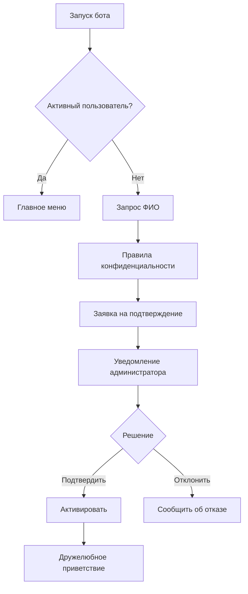
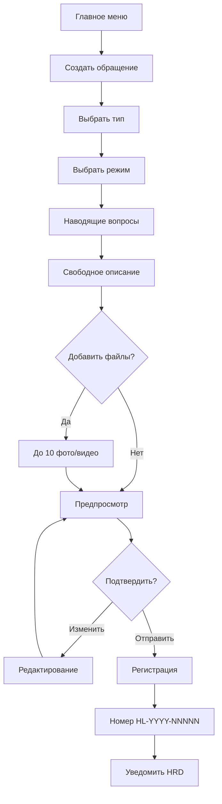
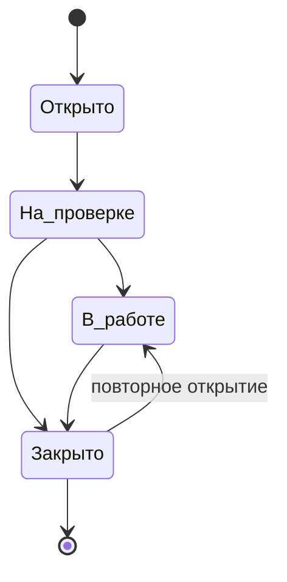
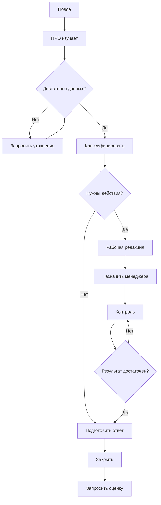
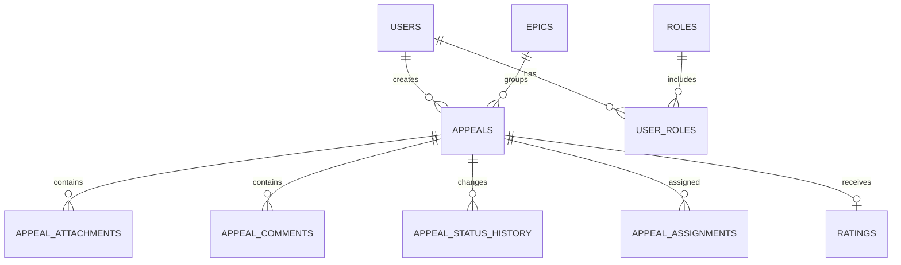
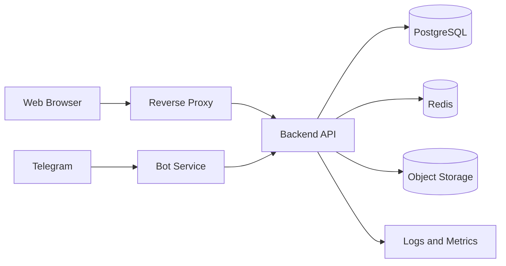
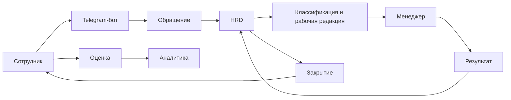

# Lemark HotLineBot
## Software Requirements Specification (SRS)
### Версия 1.0 — MVP

**Статус:** базовая спецификация для проектирования и разработки  
**Владелец процесса:** HRD  
**Технический владелец:** руководитель ИТ  
**Целевая аудитория:** руководство, HRD, администраторы, разработчики, тестировщики, DevOps  
**Расчетная аудитория:** до 200 сотрудников  

---

# 1. Назначение системы

HotLineBot — внутренняя система обратной связи предприятия Lemark. Система предназначена для получения от сотрудников информации о фактической ситуации на производстве и в подразделениях: проблемах, нарушениях, предложениях, вопросах и положительных примерах.

Основная бизнес-проблема состоит в том, что руководство может получать неполную или сглаженную картину через формальные отчеты и ограниченный круг сотрудников. Часть проблем становится известна слишком поздно, когда их уже трудно скрыть или быстро устранить. Одновременно сотрудники, которые видят несоответствия или имеют идеи, могут не обращаться напрямую из-за стеснительности, страха реакции, недоверия или отсутствия удобного канала.

Система должна дать каждому подтвержденному сотруднику простой и безопасный канал для обращения, а HRD — единый управляемый backlog с контролем статусов, ответственных и результата.

## 1.1. Бизнес-цели

1. Получать информацию от всех уровней персонала.
2. Выявлять проблемы до перехода в критическую стадию.
3. Снижать искажение информации по вертикали управления.
4. Создать единый backlog обращений.
5. Обеспечить контроль обработки и закрытия.
6. Повысить доверие сотрудников к внутренней обратной связи.
7. Выявлять повторяющиеся проблемы по эпикам и периодам.
8. Стимулировать инициативы по улучшению условий труда и процессов.

## 1.2. Границы MVP

В MVP входят:

- Telegram-бот;
- регистрация и подтверждение сотрудников;
- пять типов обращений;
- открытый и конфиденциальный режим;
- фото и видео;
- web-панель;
- карточка обращения;
- kanban;
- dashboard;
- backlog;
- уведомления;
- оценка результата;
- отчеты;
- аудит;
- резервное копирование.

В MVP не входят:

- Bitrix24 и другие интеграции;
- полностью анонимный режим;
- искусственный интеллект;
- автоматические дисциплинарные решения;
- отдельное мобильное приложение;
- LDAP/Active Directory;
- внешняя публичная форма.

---

# 2. Основные принципы

## 2.1. Доступность

Создание обращения не должно требовать специальных навыков и длинной обязательной анкеты.

## 2.2. Конфиденциальность

В конфиденциальном режиме данные автора доступны только Администратору (скрыты и требую ввода отдельного пароля)

## 2.3. Контролируемость

Каждое обращение имеет номер, статус, историю, ответственного и итог.

## 2.4. Нейтральность

Обращение не является доказательством нарушения. Оно является основанием для проверки или управленческого действия.

## 2.5. Минимизация бюрократии

Наводящие вопросы помогают сформулировать мысль, но могут быть пропущены. Обязательным остается только содержательное описание.

## 2.6. Сохранность

Обращения и действия не удаляются физически через пользовательский интерфейс.

---

# 3. Термины

| Термин | Определение |
|---|---|
| Обращение | Сообщение сотрудника, зарегистрированное в системе |
| Автор | Сотрудник, создавший обращение |
| Открытое обращение | Автор разрешает показать свои данные менеджерам |
| Конфиденциальное обращение | Автор скрыт от менеджеров; доступен HRD |
| Эпик | Тематическая группа обращений |
| Backlog item | Отдельное обращение как единица работы |
| HRD | Владелец процесса |
| Менеджер | Обработчик назначенных обращений |
| Администратор | Управляет доступом и техническими настройками |
| OБТ | Опытно-боевая эксплуатация |

---

# 4. Роли и права

## 4.1. Сотрудник

Может:

- зарегистрироваться;(В боте, заполнить анкету дождаться потверждения)
- для Web панели регистрация отдельная. (Только ответсвенные за обработку обращения сотрудники)
- создать обращение;
- выбрать режим;
- прикрепить до 10 фото/видео;
- просматривать свои обращения;
- отвечать на уточнения;
- получать уведомления;
- оценить результат; (В конце решения его обращения не важно какого типа просьба оценить качество оказанной услуги)
- запросить повторное открытие.

Не может:

- видеть чужие обращения;
- видеть внутренние комментарии;
- менять исполнителя;
- видеть служебные логи.

## 4.2. Менеджер

Может:

- видеть назначенные обращения;
- читать рабочую редакцию;
- просматривать разрешенные вложения;
- добавлять внутренние комментарии;
- фиксировать выполненные действия;
- передавать результат HRD;
- работать с kanban и backlog.

Не может:

- видеть автора конфиденциального обращения;
- менять режим конфиденциальности;
- удалять обращения;
- видеть все обращения без назначения;
- закрывать чувствительное обращение без полномочия.

## 4.3. Администратор

Может:

- подтверждать сотрудников;
- блокировать доступ;
- назначать роли;
- управлять справочниками;
- управлять шаблонами;
- выполнять техническое сопровождение;
- контролировать backup;
- просматривать технический аудит.

Администратор не должен автоматически получать доступ к содержимому конфиденциальных обращений. Технический идентификатор автора может быть доступен только через защищенный журнал и при отдельном праве.

## 4.4. HRD

HRD:

- видит все обращения;
- видит автора;
- назначает менеджеров;
- определяет тип и эпик;
- запрашивает уточнения;
    - Через чат бота.

        Сценарий:

      1. HRD в Web нажимает «Запросить уточнение».
      2. Пишет вопрос.
      3. Бот отправляет его пользователю.
      4. Пользователь отвечает в боте.
      5. Ответ автоматически появляется в карточке обращения в Web.
      6. HRD получает уведомление о новом ответе.
- контролирует сроки;
- принимает итоговый результат;
- закрывает обращение;
- формирует отчеты.

## 4.5. Матрица доступа

| Функция | Сотрудник | Менеджер | Администратор | HRD |
|---|---:|---:|---:|---:|
| Создать обращение | Да | Да | Да | Да |
| Видеть свои | Да | Да | Да | Да |
| Видеть назначенные | Нет | Да | По праву | Да |
| Видеть все | Нет | Нет | По праву | Да |
| Видеть автора открытого | Только себя | Да | По праву | Да |
| Видеть автора конфиденциального | Только себя | Нет | Только аудит | Да |
| Назначать менеджера | Нет | Нет | Нет | Да |
| Менять статус | Нет | Ограниченно | Нет | Да |
| Закрывать | Нет | По праву | Нет | Да |
| Управлять ролями | Нет | Нет | Да | По праву |
| Полные отчеты | Нет | Ограниченно | Технические | Да |

---

# 5. Регистрация и авторизация

Доступ разрешен только сотрудникам предприятия.
(Для регистрации в боте нужно заполнить анкету. Нужна будет перд началом небольшую политику. О том что они согласны на обработку данных и то что они могут оставлять свои обращения конфидициально. В этом режими ваши даные скрываются от Ответсвенных сотрудников и становяться анонимным)

Идентификация:

- Telegram user ID;
- ФИО, введенное при регистрации;
- решение администратора о подтверждении.

## 5.1. Flow регистрации

## 5.2. Статусы пользователя

- `pending`;
- `active`;
- `rejected`;
- `blocked`;
- `archived`.
Управления польщователями ТГ вывести в панель администратору как Telegramm пользователи. 
## 5.3. Приветствие

> Добро пожаловать в HotLineBot 👋  
> Здесь можно безопасно сообщить о проблеме, предложить улучшение, задать вопрос или выразить благодарность.  
> Если вы выберете конфиденциальный режим, ваши данные не будут показаны ответсвенным сотрудникам.

## 5.4. Требования

- **FR-AUTH-001:** идентификация по Telegram ID.
- **FR-AUTH-002:** обязательный ввод ФИО.
- **FR-AUTH-003:** создание обращений только после подтверждения.
- **FR-AUTH-004:** уведомление администраторов о заявке.
- **FR-AUTH-005:** подтверждение, отклонение и блокировка.
- **FR-AUTH-006:** хранение даты и автора решения.
- **FR-AUTH-007:** изменение username не влияет на доступ.
- **FR-AUTH-008:** пользователь подтверждает правила.

---

# 6. Типы обращений и эпики

## 6.1. Типы

1. Жалоба.
2. Предложение.
3. Нарушение.
4. Вопрос.
5. Благодарность.

## 6.2. Эпики

Рекомендуемый начальный справочник:

- Условия труда;
- Производственные процессы;
- Безопасность и охрана труда;
- Руководство и коммуникация;
- Персонал и HR;
- Инфраструктура и бытовые условия;
- Оборудование;
- Качество;
- Дисциплина;
- Корпоративная культура;
- Другое.

Пользователь выбирает тип. Эпик назначает или корректирует HRD.

Каждое обращение является отдельным backlog item. Эпик служит группировкой, а не отдельной задачей.

---

# 7. Конфиденциальность

## 7.1. Открытый режим

HRD и менеджеры, работающие с обращением, могут видеть ФИО автора.

## 7.2. Конфиденциальный режим

ФИО, Telegram ID, username и другие идентификаторы не отображаются менеджерам. 

Текст выбора:

> **Открыто** — HRD и менеджеры смогут видеть ваши данные.  
> **Конфиденциально** — ваши данные не будут видны ответветсвенным сотрудникам. 

## 7.3. Рабочая редакция 

HRD может создать нейтральную рабочую формулировку, чтобы:

- не раскрыть автора по деталям;
- убрать эмоциональные оценки;
- сформировать проверяемое действие.

Оригинальный текст не изменяется.

## 7.4. Требования

- **FR-CONF-001:** выбор режима до отправки.
- **FR-CONF-002:** режим показывается на подтверждении.
- **FR-CONF-003:** API менеджера не возвращает автора.
- **FR-CONF-004:** экспорт менеджера не включает автора.
- **FR-CONF-005:** просмотр автора HRD журналируется.
- **FR-CONF-006:** оригинал и рабочая редакция хранятся отдельно.

---

# 8. Наводящие вопросы

Вопросы являются подсказками. Пользователь может их пропустить.

## 8.1. Жалоба

- Что именно вас беспокоит?
- Где это происходит?
- Когда вы впервые заметили проблему?
- Повторяется ли ситуация?
- Как она влияет на работу?
- Какой результат вы считаете правильным?
- Есть ли фото или видео?

## 8.2. Предложение

- Что вы предлагаете изменить?
- Какая проблема существует сейчас?
- Как должен выглядеть улучшенный процесс?
- Что даст изменение: безопасность, качество, экономию, скорость или удобство?
- Кого затронет предложение?
- Есть ли пример, фото или видео?

## 8.3. Нарушение

- Что произошло?
- Где и когда?
- Вы наблюдали это лично?
- Есть ли риск для людей или оборудования?
- Продолжается ли нарушение сейчас?
- Есть ли подтверждающие материалы?
- Требуется ли срочная реакция?

При срочной угрозе:

> Если есть непосредственная угроза жизни или здоровью, не ждите обработки обращения. Немедленно сообщите мастеру, охране или ответственному лицу.

## 8.4. Вопрос

- Кому адресован вопрос?
- Что именно вы хотите узнать?
- С каким процессом или подразделением связан вопрос?
- Насколько срочно нужен ответ?

## 8.5. Благодарность

- Кого или какое подразделение вы хотите поблагодарить?
- За что именно?
- Можно ли передать благодарность открыто?
- Хотите приложить фото или видео?

---

# 9. Создание обращения

## 9.1. Карточка

- ID;
- публичный номер;
- тип;
- эпик;
- статус;
- режим;
- автор;
- оригинальный текст;
- рабочая редакция;
- дата;
- вложения;
- ответственный;
- комментарии;
- результат;
- оценка;
- история.

## 9.2. Требования

- **FR-APL-001:** пошаговое создание.
- **FR-APL-002:** предпросмотр.
- **FR-APL-003:** редактирование до отправки.
- **FR-APL-004:** уникальный номер.
- **FR-APL-005:** уведомление HRD.
- **FR-APL-006:** защита от двойной отправки.
- **FR-APL-007:** стартовый статус «Открыто».
- **FR-APL-008:** физическое удаление запрещено.

---

# 10. Вложения

MVP поддерживает фото и видео.

Ограничения:

- до 10 файлов;
- рекомендуемый лимит фото — 20 МБ;
- рекомендуемый лимит видео — 100 МБ;
- тип проверяется по MIME;
- файлы хранятся вне публичной директории;
- доступ выдается только после проверки роли.

Требования:

- **FR-FILE-001:** фото и видео.
- **FR-FILE-002:** максимум 10.
- **FR-FILE-003:** отклонение неподдерживаемого формата.
- **FR-FILE-004:** контролируемая загрузка.
- **FR-FILE-005:** наследование режима конфиденциальности.

---

# 11. Жизненный цикл

Основные статусы:

1. Открыто.
2. На проверке.
3. В работе.
4. Закрыто.

Внутренние подстатусы:

- ожидает уточнения;
- ожидает решения;
- ожидает результата;
- ожидает оценки;
- повторно открыто.

Правила:

- закрытие требует итогового комментария;
- изменение статуса журналируется;
- после закрытия запрашивается оценка;
- пользователь может запросить повторное открытие в течение 14 дней.

---

# 12. Flow HRD

1. Получить уведомление.
2. Открыть карточку.
3. Проверить полноту.
4. Запросить уточнение при необходимости.
5. Определить тип и эпик.
6. Решить, нужны ли действия.
7. Создать рабочую редакцию. (по желанию)
8. Назначить менеджера или оставить на себе.
9. Перевести в «В работе».
10. Контролировать результат.
11. Зафиксировать итог.
12. Ответить автору.
13. Закрыть.
14. Получить оценку.

---

# 13. Работа менеджера

Менеджер видит только назначенные обращения.

Доступно:

- рабочая редакция;
- разрешенные вложения;
- внутренние комментарии;
- фиксация действий;
- передача результата HRD.

Недоступно:

- автор конфиденциального обращения;
- полный аудит;
- удаление;
- изменение режима;
- полный экспорт.

---

# 14. Оценка результата

Шкала:

1. Не решено.
2. Скорее неудовлетворительно.
3. Частично решено.
4. В основном решено.
5. Полностью удовлетворен.

Комментарий необязателен.

Оценка 1–2 создает уведомление HRD и предложение повторно открыть обращение.

---

# 15. Telegram-интерфейс

Команды: (меню кнопками с пояснением)

- `/start`;
- `/new`;
- `/my`;
- `/help`;
- `/privacy`;
- `/cancel`.

Главное меню:

- Создать обращение;
- Мои обращения;
- Как это работает;
- Конфиденциальность;
- Помощь.

UX:

- один выбор на экран;
- кнопки «Назад» и «Отменить»;
- короткие тексты;
- подтверждение перед отправкой;
- черновик хранится 24 часа;
- сценарий восстанавливается после перезапуска.

---

# 16. Web-панель

Разделы:

1. Dashboard.
2. Обращения.
3. Kanban.
4. Backlog.
5. Отчеты.
6. Пользователи.
7. Справочники.
8. Настройки.
9. Аудит.

Dashboard:

- всего обращений;
- по статусам;
- средняя оценка;
- среднее время реакции;
- среднее время закрытия;
- по типам;
- по эпикам;
- низкие оценки;
- динамика;
- просроченные.

Список:

- номер;
- дата;
- тип;
- эпик;
- статус;
- режим;
- ответственный;
- оценка;
- последнее изменение.

Фильтры:

- период;
- статус;
- тип;
- эпик;
- ответственный;
- режим;
- вложения;
- оценка;
- просрочка.

Kanban:

- Открыто;
- На проверке;
- В работе;
- Закрыто.

Drag-and-drop допускается только для разрешенных переходов.

---

# 17. Отчеты

Обязательные показатели:

- создано;
- открыто;
- на проверке;
- в работе;
- закрыто;
- средняя оценка;
- оценки 1–2;
- среднее время реакции;
- среднее время закрытия;
- повторно открыто;
- по типам;
- по эпикам.

Экспорт MVP:

- CSV;
- XLSX.

Конфиденциальные данные не попадают в экспорт без отдельного права.

---

# 18. Уведомления

Сотруднику:

- регистрация;
- подтверждение;
- создание;
- изменение статуса;
- уточнение;
- итог;
- оценка;
- повторное открытие.

HRD:

- новое обращение;
- ответ автора;
- результат менеджера;
- низкая оценка;
- просрочка;
- запрос повторного открытия.

Менеджеру:

- назначение;
- комментарий HRD;
- изменение срока;
- возврат в работу.

На этапе ОBТ новые обращения получают HRD и администраторы.

---

# 19. Модель данных

Основные сущности:

- users;
- roles;
- user_roles;
- access_requests;
- appeals;
- appeal_assignments;
- appeal_comments;
- appeal_messages;
- appeal_attachments;
- appeal_status_history;
- epics;
- ratings;
- notifications;
- audit_log;
- system_settings.

Рекомендуемая БД: PostgreSQL 16+.

Требования:

- UUID;
- UTC;
- soft delete;
- foreign keys;
- миграции;
- индексы по статусу, дате, эпику и ответственному;
- уникальный номер обращения.

---

# 20. API

Префикс: `/api/v1`

Основные endpoints:

- `POST /auth/telegram`;
- `GET /me`;
- `POST /appeals`;
- `GET /appeals/my`;
- `GET /appeals`;
- `GET /appeals/{id}`;
- `PATCH /appeals/{id}`;
- `POST /appeals/{id}/status`;
- `POST /appeals/{id}/comments`;
- `POST /appeals/{id}/attachments`;
- `POST /appeals/{id}/assign`;
- `POST /appeals/{id}/rating`;
- `GET /users`;
- `POST /users/{id}/approve`;
- `POST /users/{id}/reject`;
- `POST /users/{id}/block`;
- `GET /reports/summary`;
- `GET /reports/epics`;
- `GET /reports/export`.

API должен:

- использовать HTTPS;
- проверять права;
- не возвращать скрытые поля;
- использовать request ID;
- иметь OpenAPI.

---

# 21. Безопасность

Web-аутентификация:

- пароль минимум 12 символов;
- Argon2id;
- временный пароль требует смены;
- 2FA для HRD и администраторов.

RBAC permissions:

- `appeal.read_all`;
- `appeal.read_assigned`;
- `appeal.read_author`;
- `appeal.assign`;
- `appeal.close`;
- `report.read`;
- `report.export`;
- `user.manage`;
- `audit.read`.

Аудит:

- вход;
- ошибки входа;
- просмотр автора;
- изменение статуса;
- назначение;
- изменение прав;
- экспорт;
- удаление;
- восстановление;
- настройки.

Защита:

- TLS;
- закрытое файловое хранилище;
- секреты вне Git;
- rate limiting;
- проверка MIME;
- защита от IDOR;
- CSRF;
- CSP;
- ограничение сессии;
- журналирование доступа.

---

# 22. Нефункциональные требования

Для 200 пользователей:

- 95% API-ответов до 500 мс без файлов;
- список до 2 секунд;
- карточка до 2 секунд;
- dashboard до 3 секунд;
- Telegram-ответ до 2 секунд.

Доступность MVP: 99,5% в месяц без учета согласованных работ.

Масштабирование:

- до 2 000 пользователей;
- до 100 000 обращений;
- несколько менеджеров;
- несколько предприятий в будущей версии.

Браузеры:

- Chrome;
- Edge;
- Firefox;
- Safari — последние две версии.

---

# 23. Резервное копирование

Политика:

- ежедневный backup БД;
- backup вложений;
- хранение минимум 30 дней;
- одна копия вне основного сервера;
- ежемесячный тест восстановления.

Цели:

- RPO — до 24 часов;
- RTO — до 4 часов.

---

# 24. Архитектура развертывания

Компоненты:

- reverse proxy;
- backend API;
- bot worker;
- PostgreSQL;
- Redis;
- object storage;
- monitoring;
- backup service.

Среды:

- development;
- staging;
- production.

CI/CD:

- lint;
- unit tests;
- build;
- dependency scan;
- image build;
- staging;
- smoke tests;
- manual approval;
- production.

---

# 25. Мониторинг

Логи не должны содержать:

- полный конфиденциальный текст;
- Telegram token;
- пароли;
- session token;
- лишние персональные данные.

Метрики:

- обращения;
- ошибки;
- latency;
- Telegram failures;
- очередь уведомлений;
- CPU/RAM;
- диск;
- backup;
- активные пользователи.

Алерты:

- API down;
- DB down;
- диск > 80%;
- backup failed;
- рост 5xx;
- Telegram errors;
- рост очереди.

---

# 26. Основные Use Cases

## UC-001. Регистрация

1. Пользователь запускает бота.
2. Вводит ФИО.
3. Принимает правила.
4. Создается заявка.
5. Администратор подтверждает.
6. Пользователь получает приветствие.

## UC-002. Создание жалобы

1. Выбор типа.
2. Выбор режима.
3. Подсказки.
4. Описание.
5. Файлы.
6. Предпросмотр.
7. Отправка.
8. Получение номера.

## UC-003. Предложение

Аналогично UC-002, с подсказками по улучшениям.

## UC-004. Нарушение

При срочной угрозе отображается предупреждение.

## UC-005. Вопрос

Пользователь формулирует вопрос и получает ответ через карточку.

## UC-006. Благодарность

Можно разрешить открытую передачу благодарности.

## UC-007. Уточнение

HRD задает вопрос, бот доставляет его автору, ответ сохраняется в карточке.

## UC-008. Назначение менеджера

HRD назначает менеджера, система скрывает автора при конфиденциальном режиме.

## UC-009. Закрытие

HRD вводит итог, закрывает, пользователь получает ответ и запрос оценки.

## UC-010. Низкая оценка

Оценка 1–2 уведомляет HRD.

## UC-011. Отчет

HRD выбирает период, группировку и экспорт.

## UC-012. Блокировка

Администратор блокирует пользователя с причиной; действие попадает в аудит.

---

# 27. Критерии приемки MVP

MVP готов к ОBТ, если:

1. Неподтвержденный пользователь не создает обращения.
2. Доступны пять типов.
3. Доступны два режима.
4. Менеджер не видит автора конфиденциального обращения.
5. HRD видит автора.
6. Прикрепляется до 10 файлов.
7. Присваивается уникальный номер.
8. HRD получает уведомление.
9. Работают четыре статуса.
10. Работает уточнение.
11. Работает назначение.
12. Работает kanban.
13. Работает dashboard.
14. После закрытия запрашивается оценка.
15. Работают отчеты.
16. Работает аудит.
17. Выполняется backup.
18. Проверено восстановление.
19. Проведен security review.
20. Подготовлена инструкция HRD.

---

# 28. Тестирование

Виды:

- unit;
- integration;
- API;
- UI;
- role access;
- security;
- backup restore;
- load;
- UAT.

Критические сценарии:

- менеджер пытается получить автора;
- пользователь пытается открыть чужое обращение;
- двойная отправка;
- запрещенный файл;
- более 10 файлов;
- недопустимый статус;
- экспорт скрытых данных;
- восстановление backup;
- временная недоступность Telegram;
- ответ после закрытия.

Нагрузочный профиль:

- 200 пользователей;
- 50 Telegram-сессий;
- 20 web-сессий;
- 100 обращений в сутки;
- 500 файлов в пиковом тесте.

---

# 29. Риски

| Риск | Влияние | Мера |
|---|---|---|
| Недоверие к конфиденциальности | Высокое | прозрачные правила, RBAC, аудит |
| HRD становится узким местом | Высокое | менеджеры, kanban, напоминания |
| Формальное закрытие | Высокое | обязательный итог и оценка |
| Утечка автора | Критическое | фильтрация API, аудит, отдельные права |
| Низкая вовлеченность | Высокое | понятное внедрение и обратная связь |
| Злоупотребления | Среднее | rate limit, блокировка, журнал |
| Рост видео | Среднее | лимиты и мониторинг |
| Недоступность Telegram | Среднее | очередь повторной доставки |

---

# 30. Roadmap

## 1.0 MVP

- регистрация;
- пять типов;
- конфиденциальность;
- вложения;
- HRD workflow;
- менеджеры;
- web;
- kanban;
- dashboard;
- отчеты;
- оценка;
- аудит;
- backup.

## 1.1

- SLA;
- напоминания;
- расширенная аналитика;
- шаблоны рабочей редакции;
- делегирование HRD.

## 1.2

- Bitrix24;
- создание задач;
- синхронизация статусов;
- уведомления руководителям.

## 2.0

- AI-классификация;
- поиск похожих обращений;
- выявление повторяющихся проблем;
- несколько предприятий.

---

# 31. Принятые допущения

1. Каждое обращение — отдельный backlog item.
2. Эпик — тематическая группировка.
3. HRD — владелец процесса.
4. Менеджер не видит автора конфиденциального обращения.
5. Полной анонимности нет.
6. Наводящие вопросы необязательны.
7. До 10 фото/видео.
8. Статусы: Открыто, На проверке, В работе, Закрыто.
9. После закрытия пользователь оценивает результат.
10. В ОBТ уведомления получают HRD и администраторы.
11. Интеграций в MVP нет.
12. Web-панель входит в MVP.
13. Рекомендуется PostgreSQL.
14. Повторное открытие — 14 дней.
15. Политика окончательного срока хранения должна быть утверждена отдельно.

---

# 32. Итоговая схема

HotLineBot должен работать как управляемый контур:

- сотрудник сообщает;
- HRD принимает решение;
- менеджер выполняет;
- система хранит историю;
- автор оценивает;
- руководство получает аналитику.

---

# 33. Каталог функциональных требований

В данном разделе требования сгруппированы по функциональным областям. Идентификаторы должны использоваться в backlog, тест-кейсах, commit-сообщениях и приемочной документации.

## 33.1. Управление пользователями

| ID | Требование | Приоритет |
|---|---|---|
| FR-USR-001 | Система должна создавать заявку на доступ при первом запуске бота | Must |
| FR-USR-002 | Заявка должна содержать Telegram ID, ФИО и дату создания | Must |
| FR-USR-003 | Администратор должен подтверждать или отклонять заявку | Must |
| FR-USR-004 | До подтверждения доступно только состояние ожидания и справка | Must |
| FR-USR-005 | Причина отклонения может быть передана пользователю | Should |
| FR-USR-006 | Администратор должен блокировать активного пользователя | Must |
| FR-USR-007 | Блокировка не удаляет историю | Must |
| FR-USR-008 | Учетная запись уволенного сотрудника переводится в архив | Should |
| FR-USR-009 | Повторная активация архивной записи журналируется | Should |
| FR-USR-010 | Один Telegram ID не может иметь две активные записи | Must |

## 33.2. Черновики

| ID | Требование | Приоритет |
|---|---|---|
| FR-DRF-001 | Система должна сохранять незавершенное обращение | Must |
| FR-DRF-002 | Черновик хранится не менее 24 часов | Should |
| FR-DRF-003 | Пользователь может продолжить черновик | Must |
| FR-DRF-004 | Пользователь может удалить черновик | Must |
| FR-DRF-005 | Черновик не отображается менеджерам | Must |
| FR-DRF-006 | Вложения черновика удаляются после истечения срока | Should |

## 33.3. Работа с обращением

| ID | Требование | Приоритет |
|---|---|---|
| FR-APP-001 | Создание обращения доступно только активному пользователю | Must |
| FR-APP-002 | Тип обращения обязателен | Must |
| FR-APP-003 | Режим конфиденциальности обязателен | Must |
| FR-APP-004 | Текст обращения обязателен | Must |
| FR-APP-005 | Эпик может быть пустым до классификации HRD | Must |
| FR-APP-006 | Предпросмотр должен показывать тип, режим, текст и вложения | Must |
| FR-APP-007 | Пользователь может изменить данные до отправки | Must |
| FR-APP-008 | После отправки оригинальный текст пользователем не редактируется | Must |
| FR-APP-009 | Дополнение после отправки сохраняется отдельным сообщением | Must |
| FR-APP-010 | Номер обращения уникален | Must |
| FR-APP-011 | Номер не должен раскрывать автора или подразделение | Must |
| FR-APP-012 | Все даты хранятся в UTC | Must |
| FR-APP-013 | В интерфейсе даты отображаются в локальной зоне предприятия | Must |
| FR-APP-014 | Физическое удаление обращения запрещено | Must |
| FR-APP-015 | Архивирование не влияет на отчеты за прошлые периоды | Must |

## 33.4. Конфиденциальность

| ID | Требование | Приоритет |
|---|---|---|
| FR-PRV-001 | Режим выбирает автор | Must |
| FR-PRV-002 | Менеджер не получает идентификаторы автора конфиденциального обращения | Must |
| FR-PRV-003 | Скрытие реализуется на backend, а не только в UI | Must |
| FR-PRV-004 | HRD может просмотреть автора | Must |
| FR-PRV-005 | Просмотр автора фиксируется в аудите | Must |
| FR-PRV-006 | Менеджер видит отметку «Конфиденциально» | Must |
| FR-PRV-007 | Вложение не должно содержать системных метаданных автора | Should |
| FR-PRV-008 | Экспорт по умолчанию обезличен | Must |
| FR-PRV-009 | Полный экспорт требует отдельного permission | Must |
| FR-PRV-010 | Изменение режима после отправки возможно только HRD по запросу автора | Should |

## 33.5. Комментарии и коммуникация

| ID | Требование | Приоритет |
|---|---|---|
| FR-COM-001 | Комментарии разделяются на внутренние и пользовательские | Must |
| FR-COM-002 | Внутренний комментарий не отправляется автору | Must |
| FR-COM-003 | Сообщение автору доставляется через Telegram | Must |
| FR-COM-004 | Ответ автора сохраняется в карточке | Must |
| FR-COM-005 | Каждое сообщение имеет автора и время | Must |
| FR-COM-006 | Редактирование отправленного сообщения журналируется | Should |
| FR-COM-007 | Удаление комментария допускается только логически | Must |
| FR-COM-008 | HRD может пометить сообщение как итоговый ответ | Must |

## 33.6. Назначение и контроль

| ID | Требование | Приоритет |
|---|---|---|
| FR-ASG-001 | HRD назначает одного основного менеджера | Must |
| FR-ASG-002 | Допускаются дополнительные участники | Should |
| FR-ASG-003 | Назначение отправляет уведомление | Must |
| FR-ASG-004 | Смена ответственного журналируется | Must |
| FR-ASG-005 | Менеджер может вернуть обращение HRD с причиной | Should |
| FR-ASG-006 | HRD может снять назначение | Must |
| FR-ASG-007 | Закрытое обращение остается в истории менеджера | Should |
| FR-ASG-008 | Менеджер не может самостоятельно добавить себе чужое обращение | Must |

## 33.7. Статусы

| ID | Требование | Приоритет |
|---|---|---|
| FR-WF-001 | Начальный статус — «Открыто» | Must |
| FR-WF-002 | Первый просмотр HRD не меняет статус автоматически | Should |
| FR-WF-003 | Принятие HRD переводит в «На проверке» | Must |
| FR-WF-004 | Назначение действий переводит в «В работе» | Must |
| FR-WF-005 | Закрытие требует итогового ответа | Must |
| FR-WF-006 | Повторное открытие требует причины | Must |
| FR-WF-007 | Недопустимые переходы блокируются backend | Must |
| FR-WF-008 | История статусов неизменяема | Must |

## 33.8. Оценки

| ID | Требование | Приоритет |
|---|---|---|
| FR-EVL-001 | Оценка доступна только автору | Must |
| FR-EVL-002 | Оценка доступна после закрытия | Must |
| FR-EVL-003 | Допустимый диапазон 1–5 | Must |
| FR-EVL-004 | Повторная оценка заменяет предыдущую с аудитом | Should |
| FR-EVL-005 | Оценка 1–2 уведомляет HRD | Must |
| FR-EVL-006 | Отсутствие оценки не мешает закрытию | Must |
| FR-EVL-007 | Средняя оценка считается только по полученным оценкам | Must |

---

# 34. Детализация экранов web-панели

## 34.1. Экран входа

Элементы:

- логин;
- пароль;
- кнопка входа;
- второй фактор;
- сообщение об ошибке;
- информация о внутреннем назначении системы.

Критерии:

- пароль не отображается;
- после пяти неуспешных попыток применяется временная задержка;
- ошибка не должна сообщать, существует ли логин;
- успешный вход журналируется.

## 34.2. Dashboard

Верхняя зона:

- выбор периода;
- быстрые фильтры;
- дата обновления;
- кнопка экспорта.

Карточки KPI:

- создано;
- открыто;
- на проверке;
- в работе;
- закрыто;
- низкие оценки;
- просрочено;
- средняя оценка.

Графики:

- динамика количества;
- распределение по типам;
- распределение по эпикам;
- время обработки;
- оценки.

Dashboard не должен использовать только цвет для обозначения состояния. Все карточки должны иметь числовое значение и подпись.

## 34.3. Реестр обращений

Таблица должна поддерживать:

- серверную пагинацию;
- сортировку;
- полнотекстовый поиск;
- сохранение фильтров;
- сброс фильтров;
- переход в карточку;
- массовый экспорт только при наличии права.

Поиск не должен индексировать персональные данные для роли менеджера.

## 34.4. Kanban

Карточка kanban содержит:

- номер;
- тип;
- эпик;
- возраст;
- ответственного;
- наличие вложений;
- низкую оценку;
- признак конфиденциальности.

При перемещении:

1. UI запрашивает изменение.
2. Backend проверяет право и допустимость.
3. Сохраняется история.
4. Отправляются уведомления.
5. UI подтверждает действие.

## 34.5. Карточка обращения HRD

Верхняя панель:

- номер;
- статус;
- тип;
- эпик;
- режим;
- ответственный;
- дата;
- действия.

Вкладки:

1. Обращение.
2. Переписка.
3. Внутренняя работа.
4. Вложения.
5. История.
6. Аудит.

Блок автора должен быть визуально отделен и иметь предупреждение для конфиденциального режима.

## 34.6. Карточка менеджера

Не содержит:

- ФИО;
- Telegram ID;
- username;
- ссылку на профиль;
- регистрационные данные;
- записи аудита о просмотре автора.

Рабочая редакция должна отображаться выше оригинала. Для конфиденциального обращения оригинал может быть скрыт решением HRD.

## 34.7. Пользователи

Функции:

- заявки на подтверждение;
- активные;
- заблокированные;
- архив;
- поиск по ФИО;
- назначение роли;
- причина блокировки;
- история административных действий.

## 34.8. Справочники

Администратор управляет:

- эпиками;
- типами при расширении;
- шаблонами уведомлений;
- причинами блокировки;
- настройками срока черновика;
- лимитами файлов;
- правилами повторного открытия.

Удаление используемого эпика запрещено; допускается деактивация.

---

# 35. Подробные Telegram-flow

## 35.1. Первый запуск

**Бот:**  
«Здравствуйте! HotLineBot — внутренний канал обратной связи Lemark. Доступ предоставляется только сотрудникам предприятия.»

Кнопки:

- Начать регистрацию;
- Как работает конфиденциальность;
- Помощь.

После ФИО:

«Проверьте данные: Иванов Иван Иванович».

Кнопки:

- Все верно;
- Исправить;
- Отменить.

## 35.2. Ожидание подтверждения

Пользователь видит:

- статус заявки;
- дату подачи;
- информационный текст;
- кнопку помощи.

Создание обращения заблокировано.

## 35.3. Главное меню

Приветствие не должно повторяться при каждом действии. В меню показываются основные кнопки.

## 35.4. Выбор типа

Каждый тип сопровождается коротким описанием:

- Жалоба — сообщить о проблеме или несправедливой ситуации.
- Предложение — предложить улучшение.
- Нарушение — сообщить о несоблюдении правил.
- Вопрос — получить официальный ответ.
- Благодарность — отметить хорошую работу.

## 35.5. Выбор режима

Перед выбором показывается четкое различие между режимами. Бот не использует слово «анонимно».

## 35.6. Сбор текста

Бот последовательно показывает подсказки, но всегда предоставляет кнопку:

- Пропустить и написать своими словами.

Пользователь может отправить одно или несколько сообщений. Перед предпросмотром они объединяются в логическую структуру.

## 35.7. Добавление вложений

После каждого файла бот показывает счетчик:

`Добавлено 3 из 10 файлов`.

Кнопки:

- Добавить еще;
- Удалить последний;
- Перейти дальше.

## 35.8. Предпросмотр

Пример:

> Тип: Предложение  
> Режим: Конфиденциально  
> Текст: ...  
> Вложения: 2 фото  
>  
> Проверьте данные перед отправкой.

Кнопки:

- Отправить;
- Изменить текст;
- Изменить режим;
- Изменить вложения;
- Отменить.

## 35.9. Мои обращения

Список содержит последние обращения. Пагинация выполняется кнопками.

Карточка:

- номер;
- тип;
- дата;
- статус;
- последнее сообщение;
- итог;
- оценка.

## 35.10. Уточнение

Сообщение HRD должно явно содержать номер обращения. Ответ пользователя привязывается к нужной карточке.

## 35.11. Закрытие и оценка

После итогового ответа:

> Обращение HL-2026-00042 закрыто. Оцените, пожалуйста, насколько результат решил вопрос.

Кнопки 1–5 и кнопка «Оценить позже».

---

# 36. Правила отчетных показателей

## 36.1. Количество созданных

Считаются обращения, созданные в выбранном периоде, независимо от текущего статуса.

## 36.2. Количество закрытых

Считаются обращения, дата закрытия которых попадает в период.

## 36.3. Время первой реакции

Интервал между созданием и переводом в «На проверке».

## 36.4. Время закрытия

Интервал между созданием и первым закрытием. Для повторно открытых дополнительно считается полное время до последнего закрытия.

## 36.5. Средняя оценка

Среднее арифметическое полученных оценок. Неоцененные обращения не считаются нулевыми.

## 36.6. Доля низких оценок

Количество оценок 1–2 / количество всех оценок × 100%.

## 36.7. Доля конфиденциальных

Количество конфиденциальных / общее количество × 100%.

## 36.8. Повторное открытие

Количество обращений, имевших переход из «Закрыто» в «В работе».

## 36.9. Backlog на конец периода

Все обращения, которые на конец периода не находились в статусе «Закрыто».

---

# 37. Детализация аудита

Каждая запись аудита содержит:

- ID;
- время UTC;
- actor user ID;
- роль;
- действие;
- объект;
- object ID;
- request ID;
- IP для web;
- user agent;
- результат;
- измененные поля без секретов;
- основание при чувствительном действии.

События высокого риска:

- просмотр автора конфиденциального обращения;
- экспорт персональных данных;
- изменение ролей;
- разблокировка;
- изменение политики хранения;
- восстановление данных;
- изменение настроек backup.

Журнал аудита должен быть append-only на уровне приложения. Обычный администратор не должен иметь функцию редактирования записей.

---

# 38. Политика хранения

До утверждения корпоративной политики применяется следующее допущение:

- обращения и история — бессрочно;
- черновики — 24 часа;
- временные загрузки — до 24 часов;
- технические application logs — 90 дней;
- security logs — 365 дней;
- backup — 30 дней;
- архивные пользователи — бессрочно для связи с историей.

Перед промышленным запуском политика должна быть согласована с руководством и ответственными за персональные данные.

---

# 39. Дополнительные критерии качества

## 39.1. Понятность

Не менее 80% участников пилота должны создать тестовое обращение без устной помощи.

## 39.2. Конфиденциальность

В тесте роли менеджера не должно быть ни одного доступного поля, позволяющего получить прямой идентификатор автора конфиденциального обращения.

## 39.3. Надежность уведомлений

Не менее 99% уведомлений должны быть доставлены либо переведены в повторную очередь с зафиксированной причиной.

## 39.4. Восстановление

Команда сопровождения должна восстановить staging из backup в пределах заявленного RTO.

## 39.5. Производительность

Нагрузочные тесты должны подтвердить требования раздела 22 без ошибок более 1%.

---

# 40. Requirements Traceability Matrix

| Бизнес-цель | Требования | Проверка |
|---|---|---|
| Получать данные от персонала | FR-AUTH, FR-APP, FR-TG | UAT регистрации и создания |
| Защитить автора | FR-CONF, FR-PRV, NFR-SEC | RBAC и security tests |
| Не терять обращения | FR-WF, audit, backup | workflow и restore |
| Контролировать исполнение | FR-ASG, kanban, dashboard | UAT HRD |
| Получать оценку результата | FR-EVL, FR-RATE | functional tests |
| Анализировать проблемы | FR-REP, эпики | report validation |
| Поддерживать рост | NFR performance/scaling | load tests |

---

# 41. Definition of Done

Функция считается завершенной, когда:

1. Требование реализовано.
2. Есть unit-тесты для бизнес-логики.
3. Есть integration-тесты для API.
4. Проверены права доступа.
5. Обновлена OpenAPI.
6. Обновлены миграции.
7. Добавлены логи и метрики.
8. Нет критических замечаний security scan.
9. Пройден code review.
10. Пройдено тестирование на staging.
11. Обновлена пользовательская документация.
12. Выполнена приемка владельцем процесса.

---

# 42. Открытые решения перед промышленным запуском

Следующие вопросы не блокируют проектирование MVP, но должны быть утверждены до production:

1. Фактический максимальный размер видео.
2. Срок хранения обращений и персональных данных.
3. Требуется ли 2FA всем менеджерам или только HRD/администраторам.
4. Кто замещает HRD.
5. Нужен ли обязательный срок первой реакции.
6. Следует ли скрывать оригинальный текст от менеджера по умолчанию.
7. Нужен ли отдельный руководительский read-only dashboard.
8. Какие эпики войдут в стартовый справочник.
9. Кто имеет право на полный экспорт.
10. Как сотруднику сообщается об отказе в регистрации.

Эти пункты должны храниться как decision log, а не оставаться устными договоренностями.
